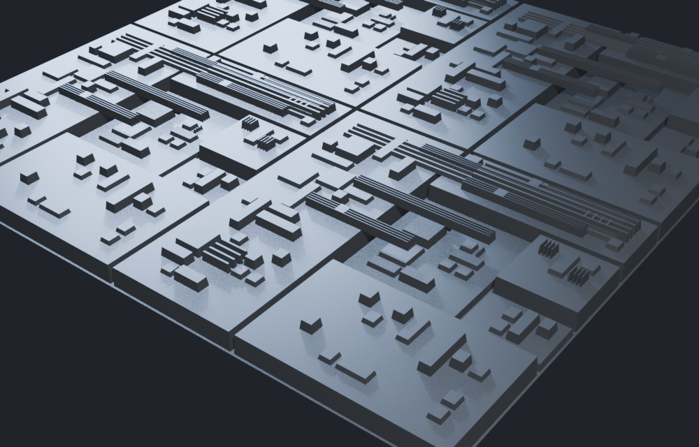

# Bulkhead

**Hull plating and greebles for Blender that look designed, not random.**

Select faces, press one button, get hierarchical panelling with continuous seam runs,
machined height steps, chamfered plate edges, and bolted-on fittings and vents. Press
F9 and reroll the seed until the layout is right.



---

## Why another greeble add-on

Most of them subdivide a surface into a grid and randomly extrude cells. The result
reads as noise, because four things are missing — and all four are what make real
plating look manufactured:

| | Grid + random extrude | Bulkhead |
|---|---|---|
| **Hierarchy** | Every plate the same size | A few large plates, more medium, many small |
| **Seams** | Jitter, stopping and starting | Continuous runs, aligned by construction |
| **Proportion** | Slivers and needles wherever the noise lands | Aspect ratio bounded; no plate degenerates |
| **Height** | A random height per cell — a skyline | A few machined levels, most plates flush |

Bulkhead builds the layout by recursive bisection, which produces hierarchy and
aligned seams as a property of the algorithm rather than as a post-process. Fittings
are placed by grid occupancy, so they never overlap and never straddle a plate edge.

## Install

Blender 4.2 or newer.

1. Download `bulkhead_free-x.y.z.zip` from [Releases](../../releases).
2. Drag the zip into Blender.

Then: select faces in Edit Mode → Tab to Object Mode → sidebar (`N`) → **Bulkhead** →
**Panel Surface**. With nothing selected it plates every quad.

Bulkhead plates four-sided faces. Non-quads are skipped and reported, not mangled.

## Free vs paid

The free edition is not a crippled demo — it has the part that carries the whole
look.

| | Free | [Bulkhead](https://gumroad.com) |
|---|---|---|
| Hierarchical plating, aligned seams | ✅ | ✅ |
| Machined height steps, chamfers | ✅ | ✅ |
| Seed rerolling from the redo panel | ✅ | ✅ |
| Fittings — greebles bolted to plates | | ✅ |
| Vents | | ✅ |

## How it works

A plate is bisected along its **longer** side, at a jittered position drawn from the
interval that satisfies both the minimum-size and maximum-aspect constraints at once.
Bisecting the long side is what stops plates becoming needles as the recursion
deepens; deriving the legal interval explicitly is what makes that a guarantee rather
than a hope.

Each plate then has a per-depth chance of stopping early. That single rule produces
the size distribution — a grid cannot produce it at all, which is why grid-based
greeblers always look flat.

Fittings claim whole cells on a grid inset from the plate edge, so overlap is
impossible by construction rather than by retrying, and the work is bounded rather
than a place-until-it-fits loop.

Geometry is emitted with correct winding by construction, and deliberately **not**
passed through `recalc_face_normals` — these prisms are open shells, and its
heuristics flip them.

A 64-quad mesh plates in well under a second, producing about 30,000 faces.

## Development

The layout maths has no `bpy` import, so it is tested in plain CPython:

```bash
python -m unittest discover -s tests -t tests
```

Those tests assert the properties that *are* the product: that plates tile the surface
exactly with no overlaps or holes, that no sliver or needle is ever emitted, that the
layout has hierarchy rather than uniform cells, that internal seams are shared rather
than orphaned, and that a given seed always reproduces.

Everything that only exists inside Blender is covered headlessly, and it renders
images at the end because this product is judged by eye:

```bash
blender --background --factory-startup --python tools/verify_in_blender.py
blender --background --factory-startup --python tools/verify_dist.py
python tools/build_addon.py
```

## Licence

GPL-3.0-or-later. A Blender add-on links Blender's Python API, so it has to be — the
paid edition included. What is sold there is the build, the updates and the support.
